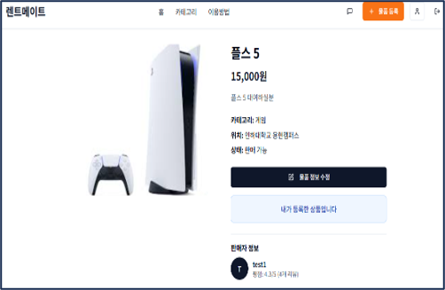
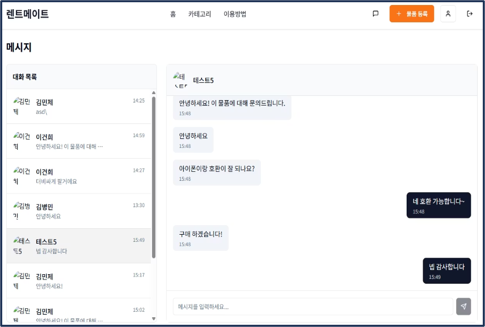

# RentMate Contribution

개인 간 중고 물품 대여를 지원하는 **RentMate** 팀 프로젝트에서 직접 기여한 기능과 구현 내용을 정리한 포트폴리오용 저장소입니다.

> 본 저장소는 팀 프로젝트 전체 소스의 소유권을 주장하기 위한 목적이 아니라, 직접 구현하거나 수정한 기능을 중심으로 정리한 개인 기여 저장소입니다.

\---

## Project Overview

RentMate는 사용자가 물품을 등록하고, 다른 사용자와 채팅한 뒤 거래 및 리뷰를 진행할 수 있도록 구성한 P2P 중고 물품 대여 웹 서비스입니다.

개인 기여 범위에서는 다음 기능을 중심으로 구현했습니다.

* Firestore 기반 데이터 처리
* 물품 등록·수정
* Firebase Storage 이미지 업로드
* Firestore 실시간 채팅
* 구매·결제 상태 처리
* 리뷰 및 평점 처리
* Kakao Maps 위치 선택 연동
* Context API 기반 인증 상태 관리

\---
## 📸 서비스 화면

<table>
  <tr>
    <td align="center">
      <b>메인 화면</b><br />
      
    </td>
    <td align="center">
      <b>물품 목록</b><br />
      
    </td>
  </tr>
  <tr>
    <td align="center">
      <b>물품 상세</b><br />
      
    </td>
    <td align="center">
      <b>실시간 채팅</b><br />
      
    </td>
  </tr>
</table>

\---

## Tech Stack

### Frontend

* React
* TypeScript
* Vite
* Tailwind CSS
* Shadcn/UI
* Lucide React
* React Router
* React Hook Form
* Zod

### Data / Infrastructure

* Firebase Firestore
* Firebase Storage
* Firebase Analytics SDK initialization

### State / Logic

* Context API
* `useReducer`
* Custom Hooks

  * `useChat`
  * `useCreateListing`
  * `useKakaoMap`

### External API

* Kakao Maps JavaScript API
* Kakao Places
* Kakao Geocoder

\---

## Repository Structure

```text
rentmate-contribution/
├─ README.md
├─ package.json
├─ vite.config.ts
├─ tsconfig.json
├─ .gitignore
├─ .env.example
│
├─ src/
│  ├─ firebase/
│  │  └─ config.ts
│  │
│  ├─ contexts/
│  │  └─ AuthContext.tsx
│  │
│  ├─ hooks/
│  │  ├─ useChat.ts
│  │  ├─ useCreateListing.ts
│  │  └─ useKakaoMap.ts
│  │
│  ├─ services/
│  │  ├─ firestoreOnlyAuthService.ts
│  │  ├─ firestoreItemService.ts
│  │  ├─ firestoreMessageService.ts
│  │  ├─ firestorePurchaseService.ts
│  │  ├─ firestorePaymentService.ts
│  │  ├─ firestoreReviewService.ts
│  │  ├─ firestoreUserService.ts
│  │  ├─ firebaseStorageService.ts
│  │  ├─ purchaseService.ts
│  │  └─ paymentService.ts
│  │
│  ├─ pages/
│  │  ├─ CreateListing.tsx
│  │  ├─ EditItem.tsx
│  │  ├─ ItemDetail.tsx
│  │  ├─ Messages.tsx
│  │  ├─ Payments.tsx
│  │  ├─ Profile.tsx
│  │  ├─ Login.tsx
│  │  └─ Register.tsx
│  │
│  └─ components/
│     ├─ chat/
│     │  ├─ ChatList.tsx
│     │  └─ ChatRoom.tsx
│     ├─ listing/
│     │  ├─ BasicInfoSection.tsx
│     │  ├─ PhotoUploadSection.tsx
│     │  ├─ DateRangeSection.tsx
│     │  ├─ RentalTermsSection.tsx
│     │  └─ SubmitButton.tsx
│     ├─ location/
│     │  └─ KakaoLocationPicker.tsx
│     └─ ReviewWriteModal.tsx
│
└─ docs/
   ├─ architecture.md
   └─ contribution.md
```

\---

## Key Contributions

### 1\. Firestore 기반 데이터 처리

물품, 구매, 결제, 리뷰, 채팅, 사용자 관련 데이터 접근 로직을 기능별 Service 모듈로 분리했습니다.

```text
UI / Page
   |
   v
Custom Hook / Context
   |
   v
Service Module
   |
   +--> Firestore
   +--> Firebase Storage
   +--> Kakao Maps API
```

화면 컴포넌트에 데이터 접근 로직이 집중되지 않도록 구성했습니다.

\---

### 2\. 물품 등록 및 수정

`useCreateListing` Custom Hook에서 물품 등록에 필요한 상태와 제출 로직을 관리했습니다.

주요 처리 내용:

* 제목, 설명, 카테고리, 위치, 가격 입력
* 대여 가능 날짜 범위를 `availableDates` 배열로 변환
* Firestore `items` 문서 생성
* 인증 사용자와 `ownerId` 연계
* 수정 화면에서 현재 사용자 ID와 물품 `ownerId` 일치 여부 확인
* 기존 이미지와 신규 이미지를 분리하여 수정

\---

### 3\. Firebase Storage 다중 이미지 업로드

여러 이미지 파일을 Firebase Storage에 업로드하고 다운로드 URL을 Firestore 물품 데이터와 연결했습니다.

주요 구현:

* 파일 크기 10MB 제한
* `image/\*` MIME Type 검증
* 고유 파일명 생성
* `public/items/{itemId}/` 경로 사용
* `Promise.all()` 기반 다중 이미지 병렬 업로드
* 다운로드 URL을 `items.images` 배열에 저장

> 이미지 자동 리사이징이나 압축 기능은 포함하지 않습니다.

\---

### 4\. Firestore 실시간 채팅

Firestore `onSnapshot`을 활용해 대화방과 메시지를 실시간으로 구독했습니다.

```text
chatRooms/{roomId}
├─ participants
├─ itemId
├─ createdAt
├─ lastMessage
│
└─ messages/{messageId}
   ├─ senderId
   ├─ content
   ├─ read
   ├─ type
   └─ createdAt
```

주요 구현:

* 기존 대화방 조회 후 중복 생성 방지
* 신규 대화방 및 초기 메시지 생성
* 메시지 전송 시 `lastMessage` 갱신
* 대화방 목록 실시간 구독
* 메시지 목록 실시간 구독
* 읽지 않은 메시지 `read` 상태 업데이트
* 컴포넌트 언마운트 시 `unsubscribe()`로 Listener Cleanup

메시지 전송 후 UI는 Optimistic Update가 아니라 Firestore `onSnapshot` 결과를 통해 갱신됩니다.

\---

### 5\. Firestore 인덱스 제약 대응

일부 복합 쿼리에서 인덱스 제약이 발생해 서버 측 `orderBy`를 제거하고 조회 후 클라이언트에서 정렬하도록 변경했습니다.

적용 사례:

* 대화방 목록 최신순 정렬
* 사용자 리뷰 최신순 정렬
* 카테고리 물품 최신순 정렬

> 별도의 `firestore.indexes.json`을 통한 복합 인덱스 적용으로 설명하지 않습니다.

\---

### 6\. Kakao Maps 위치 연동

Kakao Maps API를 이용해 물품 등록·수정 시 위치를 선택할 수 있도록 구현했습니다.

기능:

* 장소 키워드 검색
* 검색 결과 마커 표시
* 지도 클릭
* Reverse Geocoding
* 선택한 위치를 물품 `location` 값과 연계

> 거리 기반 검색이나 위치 기반 추천 기능은 포함하지 않습니다.

\---

### 7\. 구매 및 물품 상태 연계

Firestore `purchases` 컬렉션을 이용해 거래 상태를 관리했습니다.

주요 흐름:

```text
구매 완료
   |
   v
item.available = false

구매 취소
   |
   v
item.available = true
```

구매 완료 여부는 리뷰 작성 가능 여부 확인에도 사용했습니다.

\---

### 8\. 결제 상태 관리

Firestore에서 다음 상태를 관리하도록 구현했습니다.

```text
pending
held
completed
failed
refunded
released
```

주요 처리:

* 결제 생성 → `held`
* 결제 취소 → `refunded`
* 결제 확정 → `completed`
* 거래 완료 → `released`

이는 **에스크로 거래 흐름을 반영한 상태 관리**이며, 실제 PG사 결제 승인이나 실제 자금 정산 기능은 포함하지 않습니다.

\---

### 9\. 리뷰 및 평점

구매 완료 여부를 확인한 뒤 리뷰 작성이 가능하도록 구성했습니다.

리뷰 데이터에는 다음 정보를 연계했습니다.

* `itemId`
* `purchaseId`
* `reviewerId`
* `revieweeId`
* `rating`
* `content`

사용자별 리뷰를 조회한 뒤 평균 평점과 리뷰 수를 계산하여 프로필 및 물품 상세 정보에 활용했습니다.

\---

### 10. 인증 상태 관리

`AuthContext`와 `useReducer`를 이용해 인증 상태를 전역 관리했습니다.

구현 내용:

- 로그인
- 회원가입
- 로그아웃
- 인증 로딩·오류 상태 관리
- 프로토타입용 사용자 식별 토큰을 `localStorage`에 저장
- 재접속 시 저장된 토큰의 사용자 ID와 만료 정보를 확인해 인증 상태 복원
- React Hook Form + Zod 기반 로그인·회원가입 입력 검증

\---

## Parallel Processing

### `Promise.all()`

* 다중 이미지 업로드
* 메시지 읽음 상태 업데이트

### `Promise.allSettled()`

프로필에서 다음 데이터를 병렬 조회했습니다.

* 사용자 등록 물품
* 리뷰
* 구매 내역

한 요청이 실패하더라도 나머지 데이터는 계속 표시할 수 있도록 개별 결과를 처리했습니다.

\---

## Troubleshooting

### Firestore 인덱스 제약

**Problem**

일부 Firestore 조회에서 `where`와 `orderBy` 조합으로 인덱스 관련 오류가 발생했습니다.

**Action**

서버 측 `orderBy`를 제거하고 필요한 조건으로 데이터를 조회한 뒤 클라이언트에서 최신순으로 정렬했습니다.

**Result**

복합 인덱스를 별도로 추가하지 않고도 필요한 조회 흐름을 유지했습니다.

\---

### 실시간 채팅 상태 동기화

**Problem**

새 메시지와 대화방 최근 메시지를 화면에 지속적으로 반영할 필요가 있었습니다.

**Action**

`ChatList`와 `ChatRoom`에 Firestore `onSnapshot` 리스너를 적용하고, 메시지 전송 시 `lastMessage`를 함께 갱신했습니다.

**Result**

Firestore의 데이터 변경을 기준으로 채팅 UI가 실시간 갱신되도록 구성했습니다. 화면 이탈 시에는 `unsubscribe()`로 리스너를 정리했습니다.

\---

### 다중 이미지 업로드

**Problem**

한 물품에 여러 이미지를 업로드하고 각각의 다운로드 URL을 물품 데이터와 연결해야 했습니다.

**Action**

파일 크기와 MIME Type을 검증한 후 이미지별 업로드 Promise를 생성하고 `Promise.all()`로 병렬 처리했습니다.

**Result**

여러 이미지의 다운로드 URL을 배열로 수집하여 Firestore `items.images`와 연계했습니다.

\---

### 프로필 복합 데이터 조회

**Problem**

프로필 화면에서 물품, 리뷰, 구매 내역을 함께 조회하면서 하나의 요청 실패가 전체 데이터 로딩 실패로 이어질 수 있었습니다.

**Action**

각 조회를 `Promise.allSettled()`로 병렬 실행하고 결과를 독립적으로 처리했습니다.

**Result**

일부 데이터 요청에 문제가 발생해도 성공한 데이터는 화면에 표시할 수 있도록 구성했습니다.

\---

## Verified Scope

이 저장소에서는 실제 구현 코드로 확인된 범위만 설명합니다.

* Firestore 기반 물품 CRUD
* 구매·결제·리뷰 데이터 처리
* `onSnapshot` 기반 실시간 채팅
* Listener Cleanup
* Firebase Storage 다중 이미지 업로드
* Context API 기반 인증 상태 관리
* Kakao Maps 위치 선택
* 구매 상태와 물품 상태 연계
* 구매 완료 여부 기반 리뷰 작성
* 평균 평점 및 리뷰 수 계산
* `Promise.all` / `Promise.allSettled` 병렬 처리

\---

## Documents

* [`docs/architecture.md`](docs/architecture.md): 실제 구현 기준 시스템 구조 및 데이터 흐름
* [`docs/contribution.md`](docs/contribution.md): 개인 기여 기능과 구현 범위 상세 정리

\---

## Environment Variables

공개 저장소에는 실제 API Key를 포함하지 않습니다.

`.env.example`

```env
VITE\_FIREBASE\_API\_KEY=
VITE\_FIREBASE\_AUTH\_DOMAIN=
VITE\_FIREBASE\_PROJECT\_ID=
VITE\_FIREBASE\_STORAGE\_BUCKET=
VITE\_FIREBASE\_MESSAGING\_SENDER\_ID=
VITE\_FIREBASE\_APP\_ID=
VITE\_FIREBASE\_MEASUREMENT\_ID=
VITE\_KAKAO\_MAP\_API\_KEY=
```

실제 `.env` 파일은 Git에 커밋하지 않습니다.

\---

## Notes

이 저장소는 채용 포트폴리오 목적으로 팀 프로젝트에서 직접 기여한 기능을 중심으로 정리했습니다.

프로젝트 전체 기능과 개인 구현 범위를 구분하며, 실제 구현하지 않은 기능은 성과로 기술하지 않습니다.

## Security / Scope Note

본 저장소는 팀 프로젝트에서 직접 구현한 기능을 포트폴리오 목적으로 정리한 코드입니다.

인증은 프로토타입용 사용자 식별 토큰을 기반으로 하며, 실제 JWT 서명 검증이나 Firebase Authentication을 사용하지 않습니다.

또한 Firestore Security Rules 구현은 본 저장소의 개인 기여 범위로 설명하지 않습니다. 따라서 클라이언트의 로그인·소유자 확인 로직은 운영 환경의 서버 측 권한 통제를 대체하지 않습니다.

