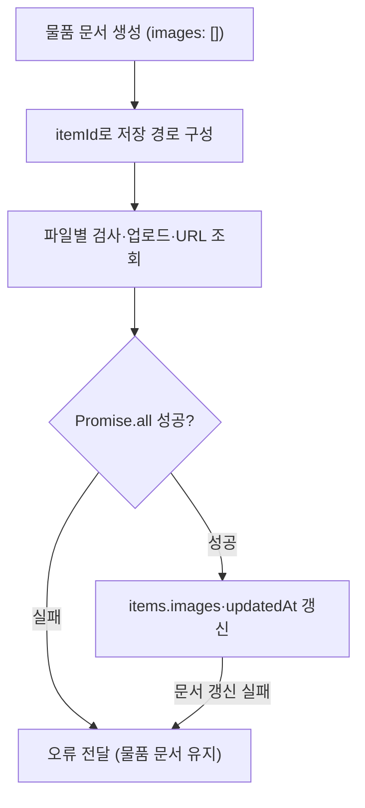

# RentMate Architecture

## 1\. 문서 목적

이 문서는 팀 프로젝트 **RentMate - P2P 중고 물품 대여 웹 서비스**에서 실제 구현된 코드 구조를 기준으로 주요 아키텍처와 데이터 흐름을 정리합니다.

본 저장소는 전체 팀 프로젝트를 재현하기보다, 개인 기여 기능과 관련된 구현 구조를 중심으로 정리하는 것을 목적으로 합니다.

---

## 2\. 전체 구조

RentMate는 React + TypeScript 기반 프론트엔드에서 Firebase Firestore와 Firebase Storage를 직접 사용하는 구조입니다.

```text
\[ React / TypeScript ]
        |
        |-- Pages
        |-- Components
        |-- Custom Hooks
        |-- Context API
        |
        v
\[ Service Modules ]
        |
        |-- Firestore
        |-- Firebase Storage
        |-- Kakao Maps API
```

핵심 데이터 접근 로직은 화면 컴포넌트에서 직접 작성하지 않고 기능별 Service 모듈로 분리했습니다.

---

## 3\. 주요 기술 스택

### Frontend

* React
* TypeScript
* Vite
* Tailwind CSS
* Shadcn/UI
* Lucide React
* React Router
* React Hook Form
* Zod

### State / Application Logic

* Context API
* `useReducer`
* Custom Hooks

  * `useChat`
  * `useCreateListing`
  * `useKakaoMap`

### Data / Infrastructure

* Firebase Firestore
* Firebase Storage
* Firebase Analytics SDK initialization

### External API

* Kakao Maps JavaScript API
* Kakao Places
* Kakao Geocoder

---

## 4\. 디렉터리 역할

```text
src/
├─ components/
│  ├─ chat/
│  ├─ listing/
│  └─ location/
│
├─ contexts/
│  └─ AuthContext.tsx
│
├─ hooks/
│  ├─ useChat.ts
│  ├─ useCreateListing.ts
│  └─ useKakaoMap.ts
│
├─ pages/
│  ├─ CreateListing.tsx
│  ├─ EditItem.tsx
│  ├─ ItemDetail.tsx
│  ├─ Messages.tsx
│  ├─ Payments.tsx
│  ├─ Profile.tsx
│  ├─ Login.tsx
│  └─ Register.tsx
│
├─ services/
│  ├─ firestoreOnlyAuthService.ts
│  ├─ firestoreItemService.ts
│  ├─ firestoreMessageService.ts
│  ├─ firestorePurchaseService.ts
│  ├─ firestorePaymentService.ts
│  ├─ firestoreReviewService.ts
│  ├─ firestoreUserService.ts
│  ├─ firebaseStorageService.ts
│  ├─ purchaseService.ts
│  └─ paymentService.ts
│
└─ firebase/
   └─ config.ts
```

---

## 5\. 인증 구조

인증 상태는 `AuthContext`와 `useReducer`를 이용해 전역 관리합니다.

```text
Login / Register
      |
      v
AuthContext
      |
      |-- login()
      |-- register()
      |-- logout()
      |
      v
firestoreOnlyAuthService
      |
      v
Firestore users
```

로그인 성공 시 사용자 식별 토큰을 `localStorage`의 `auth\_token`에 저장합니다.

앱 재접속 시에는 저장된 토큰에서 사용자 ID와 만료 정보를 확인한 뒤 Firestore에서 사용자 정보를 다시 조회하여 인증 상태를 복원합니다.

> Firebase Authentication을 사용하는 구조는 아닙니다.

---

## 6\. 물품 등록 및 수정 흐름

물품 등록 로직은 `useCreateListing` Custom Hook으로 분리했습니다.

```text
CreateListing
     |
     v
useCreateListing
     |
     |-- Form State
     |-- Validation
     |-- Date Range -> availableDates
     |-- Image Files
     |
     v
itemService
     |
     v
firestoreItemService
     |
     +------> Firestore items
     |
     +------> firebaseStorageService
                    |
                    v
              Firebase Storage
```

### 등록 처리

1. 제목, 설명, 카테고리, 위치, 가격 입력
2. 대여 가능 기간 선택
3. 날짜 범위를 `availableDates` 배열로 변환
4. `images: []`인 Firestore `items` 문서를 생성하고 `docRef.id` 확보
5. 이미지가 있으면 생성된 물품 ID로 Storage 경로를 구성하여 파일별 검사·업로드·URL 조회 실행
6. `Promise.all()`이 성공하면 다운로드 URL 배열을 해당 물품의 `images`에 저장하고 `updatedAt` 갱신

문서 생성 → 생성된 물품 ID로 이미지 업로드 → 다운로드 URL 배열로 물품 문서 갱신의 순서입니다. 이미지 처리 단계가 실패해도 먼저 생성한 문서는 남으며, 실패 상태를 오류로 전달합니다.

### 수정 처리

물품 수정 시 현재 로그인 사용자가 해당 물품의 `ownerId`와 일치하는지 확인합니다.

이미지는 기존 이미지 URL과 신규 파일을 분리해 관리하며, 새로 추가된 이미지만 Storage에 업로드한 뒤 기존 URL과 합쳐 Firestore를 갱신합니다.

---

## 7\. 이미지 저장 구조

이미지 파일의 저장 경로는 `public/items/{itemId}/{fileName}`입니다. `itemId`는 물품 문서를 생성한 결과에서 얻고, 파일명은 물품 ID·현재 시각·난수·확장자를 조합합니다. 파일명 충돌 가능성을 줄이는 방식이며, 충돌의 완전한 방지를 보장하지 않습니다.

파일마다 `10 * 1024 * 1024`바이트 이하인지, `File.type`이 `image/`로 시작하는지 검사한 뒤 해당 파일을 업로드합니다. 업로드 결과에서 `getDownloadURL()`로 URL을 얻고, `Promise.all()`이 모든 결과를 수집하면 물품 문서를 갱신합니다.



이미지 작업은 병렬로 실행하지만 물품 문서의 URL 배열은 전체 성공 후 한 번 갱신합니다. 일부 작업이 실패하면 URL 갱신으로 진행하지 않으며, 다른 업로드를 취소하거나 성공한 파일을 삭제하는 처리는 없습니다.

업로드 이후 문서 갱신 실패도 같은 이미지 업로드 실패 메시지로 전달합니다. 문서·파일의 자동 롤백, 자동 재시도, 이미지 리사이징·압축은 구현하지 않았습니다.

관련 코드: [firestoreItemService.ts](../src/services/firestoreItemService.ts), [firebaseStorageService.ts](../src/services/firebaseStorageService.ts)

---

## 8\. 실시간 채팅 구조

채팅 데이터는 Firestore의 `chatRooms` 컬렉션과 메시지 서브컬렉션으로 구성합니다.

```text
chatRooms/{roomId}
├─ participants
├─ itemId
├─ createdAt
├─ lastMessage
│
└─ messages/{messageId}
   ├─ senderId
   ├─ content
   ├─ read
   ├─ type
   └─ createdAt
```

### 대화 시작

```text
ItemDetail
    |
    v
useChat.startChat()
    |
    v
createConversationInFirestore()
    |
    +--> 기존 대화방 검색
    |
    +--> 없으면 chatRooms 생성
    |
    +--> 초기 메시지 저장
    |
    +--> lastMessage 갱신
    |
    v
Messages Page
```

현재 사용자, 상대 사용자, `itemId`를 기준으로 기존 대화방을 확인해 동일 거래 대상에 대한 중복 대화방 생성을 방지합니다.

---

## 9\. 실시간 메시지 처리

`ChatRoom`에서는 다음 경로를 Firestore `onSnapshot`으로 구독합니다.

```text
chatRooms/{roomId}/messages
```

메시지는 `createdAt ASC` 기준으로 정렬됩니다.

```text
Firestore
    |
    | onSnapshot
    v
ChatRoom
    |
    v
React State
    |
    v
UI Rendering
```

메시지 전송 시 Firestore에 메시지를 저장하고, 채팅방의 `lastMessage`를 갱신합니다.

화면의 메시지 목록은 별도의 Optimistic Update가 아니라 Firestore `onSnapshot` 결과를 통해 갱신됩니다.

컴포넌트 언마운트 시 `unsubscribe()`를 호출하여 리스너를 정리합니다.

---

## 10\. 대화방 목록

`ChatList`도 `chatRooms` 컬렉션을 `onSnapshot`으로 구독합니다.

```text
chatRooms
   |
   | participants array-contains userId
   v
onSnapshot
   |
   +--> participant 정보 조회
   +--> item 정보 조회
   |
   v
lastMessage.createdAt 기준 클라이언트 정렬
```

Firestore 인덱스 제약을 피하기 위해 일부 조회에서는 서버 `orderBy` 대신 조회 후 클라이언트 정렬 방식을 사용했습니다.

---

## 11\. 메시지 읽음 처리

대화방 진입 시 다음 조건에 해당하는 메시지를 조회합니다.

```text
senderId != currentUser
read == false
```

조회된 각 문서에 `updateDoc(..., { read: true })`를 수행하고 `Promise.all()`로 완료를 기다립니다.

> 이 구현은 Firestore `writeBatch()` 기반 Atomic Batch Write가 아닙니다.

---

## 12\. Kakao Maps 연동

위치 기능은 `useKakaoMap`과 `KakaoLocationPicker`를 통해 구현합니다.

```text
Kakao Maps SDK
      |
      +--> Places Keyword Search
      +--> Marker
      +--> Map Click
      +--> Reverse Geocoding
      |
      v
selectedLocation
      |
      v
BasicInfoSection
      |
      v
item.location
```

지원 기능은 다음과 같습니다.

* 장소 키워드 검색
* 검색 결과 마커 표시
* 지도 범위 자동 조정
* 지도 클릭
* 좌표 기반 Reverse Geocoding
* 장소 선택 후 지도 중심 이동
* 선택된 위치를 물품 `location` 값과 연계

거리 기반 물품 검색이나 좌표 기반 근접 검색은 구현하지 않았습니다.

---

## 13\. 구매 흐름

구매 정보는 Firestore `purchases` 컬렉션에 저장합니다.

| 필드 | 데이터 연결 |
|---|---|
| `itemId` | 요청 물품의 문서 ID |
| `buyerId` | 사용자 식별 토큰에서 얻은 ID |
| `sellerId` | 조회한 물품의 `ownerId` |
| `amount` | 함수에 전달된 금액 |
| `status` | 생성 시 `completed` |
| `createdAt·completedAt` | 생성 시 서버 타임스탬프 |

### 생성 순서

1. 사용자 ID를 확인하고 물품 문서를 조회합니다.
2. 물품이 없거나 `available`이 거짓이면 오류를 반환합니다.
3. 구매 문서를 `completed` 상태로 생성합니다.
4. 해당 물품의 `available`을 `false`로 갱신합니다.

생성 시 바로 완료 상태를 저장하는 프로토타입이며, 결제 승인이나 대여 종료를 확인하는 단계는 아닙니다.

### 상태 변경 함수

`updatePurchaseStatusInFirestore()`는 구매 문서에서 물품 ID를 얻고, 물품 상태를 먼저 변경한 뒤 구매 상태를 갱신합니다.

| 요청 상태 | 물품 `available` | 구매 문서 |
|---|---|---|
| `completed` | `false` | 상태·완료 시각·수정 시각 갱신 |
| `cancelled` | `true` | 상태·수정 시각 갱신 |

각 문서는 순차적으로 갱신합니다. `available` 검사는 조회 시점의 상태에 따른 요청 검사이며, 트랜잭션을 통한 동시 요청의 중복 거래 방지나 문서 간 원자성을 보장하지 않습니다.

관련 코드: [firestorePurchaseService.ts](../src/services/firestorePurchaseService.ts)

---

## 14\. 결제 상태 구조

결제 정보는 별도의 `payments` 컬렉션으로 관리합니다.

주요 상태는 다음과 같습니다.

```text
pending
held
completed
refunded
released
failed
```

구현된 상태 변경 흐름은 다음과 같습니다.

```text
결제 생성
   |
   v
 held
 / | \\
v  v  v
refunded
completed
released
```

이는 에스크로 거래 흐름을 표현하기 위한 상태 관리이며, 실제 PG사 카드 승인이나 실제 자금 정산 기능은 포함하지 않습니다.

---

## 15\. 리뷰 구조

### 일반 구매 리뷰

예약 ID가 없는 일반 구매 리뷰는 `checkPurchaseCompletedInFirestore(itemId, userId)`로 다음 조건을 조회합니다.

| 조회 필드 | 조건 |
|---|---|
| `itemId` | 리뷰 대상 물품 ID와 일치 |
| `buyerId` | 작성자 ID와 일치 |
| `status` | `completed` |

조회 결과가 없거나 조회에 실패하면 `canReview: false`로 처리하고 리뷰 생성을 거부합니다.

리뷰 문서에는 `itemId·reviewerId·revieweeId·rating·content·createdAt`을 저장하며, 완료 구매 조회에서 얻은 `purchaseId`가 있으면 함께 기록합니다. 이 구매 ID는 조회 결과의 첫 문서에서 얻고, 후기 모달에서 선택한 구매 ID를 직접 전달받지 않습니다.

### 구매 내역의 후기 작성 상태

완료 구매마다 `purchaseId == 구매 문서 ID`, `reviewerId == 현재 사용자 ID`로 기존 리뷰를 조회해 `hasReview`를 구성합니다. 프로필 화면은 이 값에 따라 후기 작성 버튼 또는 작성 완료 표시를 제공하며, 후기 제출 후 구매 내역을 다시 조회합니다.

### 예약 리뷰 분기와 중복 작성 범위

예약 ID가 있는 리뷰 분기는 물품·예약 존재 여부를 확인하고 예약의 `ownerId`를 리뷰 대상자로 사용합니다. 완료 구매 조회를 추가로 실행하더라도 그 결과로 작성을 차단하지 않으며, 예약 완료 상태 검사도 없습니다.

기존 리뷰에 따른 화면 표시와 별개로 리뷰 생성 함수에는 중복 작성 검사가 없습니다. 모든 리뷰 경로에서 완료 거래 검증이나 중복 작성 방지를 보장한다고 설명하지 않습니다.

사용자에게 작성된 리뷰는 `revieweeId`로 조회하며, 클라이언트에서 평균 평점과 리뷰 수를 계산합니다.

관련 코드: [firestoreReviewService.ts](../src/services/firestoreReviewService.ts), [firestorePurchaseService.ts](../src/services/firestorePurchaseService.ts), [Profile.tsx](../src/pages/Profile.tsx), [ReviewWriteModal.tsx](../src/components/ReviewWriteModal.tsx)

---

## 16\. 프로필 데이터 조회

프로필 화면에서는 여러 종류의 데이터를 병렬로 조회합니다.

```text
Profile
  |
  +--> User Profile
  |
  +--> My Items
  |
  +--> Reviews
  |
  +--> Purchases
```

물품, 리뷰, 구매 내역은 `Promise.allSettled()`로 처리해 특정 요청이 실패하더라도 다른 데이터까지 함께 실패하지 않도록 구성했습니다.

---

## 17\. Firestore 쿼리 제약 대응

프로젝트에는 별도의 `firestore.indexes.json` 파일이 없습니다.

일부 쿼리에서는 Firestore 인덱스 오류를 피하기 위해 서버 측 `orderBy`를 제거하고 클라이언트 정렬 방식을 사용했습니다.

적용 사례:

* 대화방 목록 최신순 정렬
* 사용자 리뷰 최신순 정렬
* 카테고리 물품 최신순 정렬

따라서 본 프로젝트에서 **복합 인덱스 최적화를 적용했다고 표현하지 않습니다.**

---

## 18\. 실제 구현 범위

* Firestore 기반 물품 CRUD
* Firestore 기반 구매·결제·리뷰 데이터 처리
* `onSnapshot` 기반 실시간 대화방 및 메시지 구독
* 메시지 읽음 처리
* `lastMessage` 갱신
* 실시간 Listener Cleanup
* Firebase Storage 다중 이미지 업로드
* 이미지 파일 크기 및 MIME Type 검증
* Context API + `useReducer` 인증 상태 관리
* 사용자 식별 토큰 기반 재접속 상태 복원
* React Hook Form + Zod 입력 검증
* Kakao Maps 장소 검색·마커·역지오코딩
* 구매 상태와 물품 `available` 상태 연계
* 일반 구매 리뷰의 물품·구매자·완료 조건 검사 및 구매 내역의 후기 작성 상태 연계
* 평균 평점 및 리뷰 수 계산
* `Promise.all` / `Promise.allSettled` 병렬 처리

---

## 19\. 핵심 설계 요약

RentMate는 별도의 백엔드 서버 대신 Firestore와 Firebase Storage를 중심으로 데이터를 처리하고, 화면과 데이터 접근 로직 사이에 Service 모듈과 Custom Hook을 배치한 구조입니다.

특히 개인 기여 기능에서는 다음 흐름을 중심으로 구현했습니다.

```text
UI
 |
 v
Custom Hook / Context
 |
 v
Service Module
 |
 +--------> Firestore
 |
 +--------> Firebase Storage
 |
 +--------> Kakao Maps API
```

실시간 기능은 Firestore `onSnapshot`을 이용하고, 이미지와 프로필 데이터 처리에는 Promise 기반 병렬 처리를 활용했습니다.

이 구조를 통해 물품 등록·이미지 저장·실시간 채팅·거래 상태·리뷰·위치 선택 기능을 하나의 P2P 대여 서비스 흐름으로 연결했습니다.


## 공개 범위와 보안

[프로토타입 한계와 보안 범위](scope-and-security.md)에서 로그인·권한 통제·결제·기능 범위를 함께 설명합니다.
